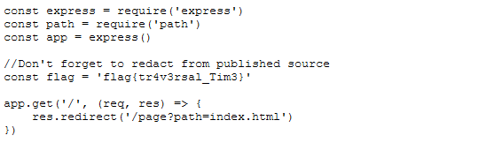

This is a write up for the tux-fanpage challenge for the 2020 redpwnCTF competition. This challenge is one that I found very interesting as I love challenges that use URL parameter tampering. And honestly, I spent way too much time on it before figuring it out LOL.

# Challenge intro

```
My friend made a fanpage for Tux; can you steal the source code for me?

Site: tux-fanpage.2020.redpwnc.tf
```

The challenge also provides the source file for index.js.

# Discovery
After downloading the source code and reviewing, the application looks like a simple ExpressJS web server that returns a file via a path query parameter `/page?path=index.html`.

One of the first things I noticed was a line in the source code displaying a `flag` variable: 
```javascript
//Don't forget to redact from published source
const flag = '[REDACTED]'
```

That interesting... If we could read the source that the web server was hosting directly, I bet it would have the unredacted flag there..

After more review of the code, I noticed the path traversal prevention for the path url parameter. The code finds any `../` strings in the path string and replaces them with an empty string, effectively removing direct path traversal attempts of the path parameter (even with URL encoding applied).

```javascript
//Prevent directory traversal attack
function preventTraversal(dir){
    if(dir.includes('../')){
        let res = dir.replace('../', '')
        return preventTraversal(res)
    }

    //In case people want to test locally on windows
    if(dir.includes('..\\')){
        let res = dir.replace('..\\', '')
        return preventTraversal(res)
    }
    return dir
}
```
If I was going to be able to read the local index.js file, I was going to need a way to bypass the path traversal preventions that they've put in place. While hard, it didn't seem impossible.

Hold on, thats not all though. There is also code that removed any leading characters that were not alphanumeric. This means that whatever payload I come up with will need to start with an alphanumeric number.

```javascript
//Strip leading characters
function strip(dir){
    const regex = /^[a-z0-9]$/im

    //Remove first character if not alphanumeric
    if(!regex.test(dir[0])){
        if(dir.length > 0){
            return strip(dir.slice(1))
        }
        return ''
    }

    return dir
}
```

After some quick inspection of the index.html page, I noticed there was an assets folder, so I figured ultimately, my payload would need to look something like `assets/../../index.js`

After many failed attempts and exhausting all possible encoding inputs for path traversal, I remembered that I didn't only have to submit the path parameter as a string. If the application was expecting a string but did not do any type validation, it would be possible to control the flow of the code by passing it a type that it wasn't designed to work with, such as an object or an array!

Passing something like the following to the path parameter, `https://tux-fanpage.2020.redpwnc.tf/page?path[]=a&path[]=b`, we can convert it to an array. Because of the loosely typed nature of javascript, if the object that we pass has some of the same methods and properties that the `string` type has, we may be able to have it skirt the security checks and get path traversal. Luckily, the methods that are called against the path string, the array object also has! Specifically, `.includes('../')` and concating the array with a string.

One important thing to remember with an array, is that when an array is converted to a string, either by calling `.toString()` or by concatenating it with another string, like how the path parameter is in the below code,
```javascript
    res.sendFile(prepare(path), (err) => {
        if(err){
            if (! res.headersSent) {
                try {
                    res.send(strip(req.query.path) + ' not found')
                } catch {
                    res.end()
                }
            }
        }
    })
    
    //Get absolute path from relative path
function prepare(dir){
    return path.resolve('./public/' + dir)
}
```

it will concatenate all of the members of the array into a string but will also place a comma between each members string representation. For example, in this url, `https://tux-fanpage.2020.redpwnc.tf/page?path[]=a&path[]=b`, the path parameter's string representation will look like this: `a,b`. 

This is important to note because when the `path` url query parameter is concatenated with the `./public/` string, the commas can affect whether the correct path is resolved or not.

# Solution
Putting this all together, we can construct the below URL to successfully gain path traversal and grab our flag!

`https://tux-fanpage.2020.redpwnc.tf/page?path[]=a&path[]=/../../index.js`


